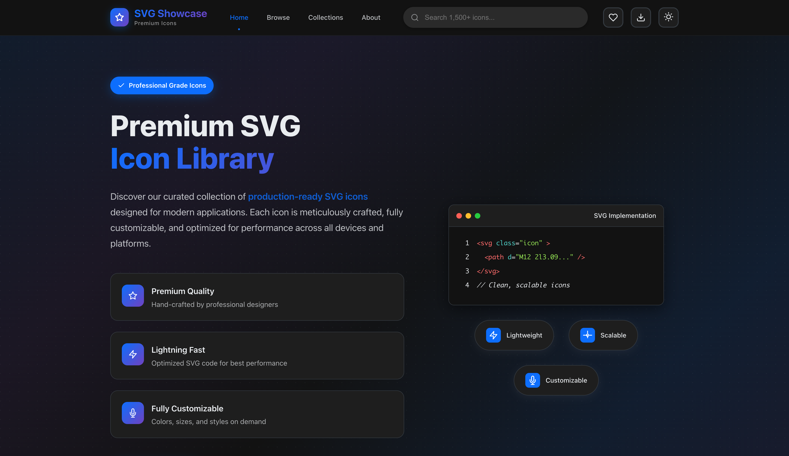
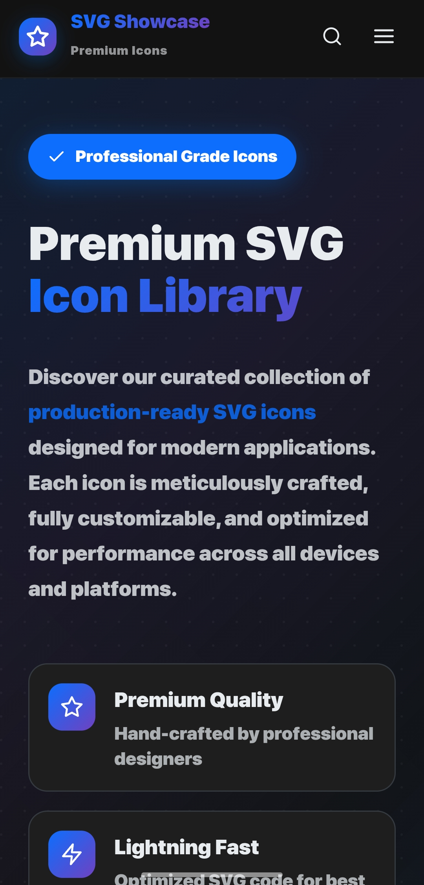
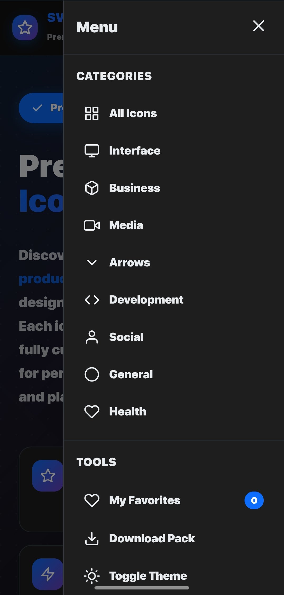

# 🎨 SVG Icon Showcase

<div align="center">


**A modern, responsive web application for browsing, customizing, and managing SVG icons**

[](https://devchauhann.github.io/svg/)
[](https://opensource.org/licenses/MIT)
[](https://github.com/devchauhann/svg-icon-showcase/stargazers)

</div>

## ✨ Features

### 🎯 **Core Functionality**
- **🔍 Smart Search**: Real-time icon search with instant filtering
- **📂 Category Browsing**: Organized icons by categories (Interface, Business, Media, Arrows, Development, Social, General, Health)
- **🎨 Live Customization**: Real-time color and size adjustments
- **📋 One-Click Copy**: Instant SVG code copying to clipboard
- **❤️ Favorites System**: Save and manage your favorite icons with persistent storage

### 📱 **Mobile-First Design**
- **📱 Responsive Layout**: Seamless experience across all devices
- **🍔 Mobile Menu**: Feature-rich mobile navigation with smooth animations
- **👆 Touch-Friendly**: Optimized for touch interactions
- **🌙 Theme Support**: Beautiful light and dark mode themes

### 🚀 **Advanced Features**
- **⚡ Performance Optimized**: Lazy loading and efficient rendering
- **🎭 Modal Preview**: Detailed icon preview with live editing
- **💾 Local Storage**: Persistent favorites and preferences
- **🎨 Theme Switching**: Smooth light/dark mode transitions
- **📊 Live Statistics**: Real-time icon count and category information

## 🖼️ Screenshots

<div align="center">

### Desktop View
![Desktop Screenshot]

### Mobile View & Features
<div style="display: flex; gap: 20px; justify-content: center;">


</div>

</div>

## 🚀 Quick Start

### 📦 Installation

1. **Clone the repository**
   ```bash
   git clone https://github.com/devchauhann/svg-icon-showcase.git
   cd svg-icon-showcase
   ```

2. **Open in browser**
   ```bash
   # Simply open index.html in your preferred browser
   open index.html
   # OR serve with a local server
   python -m http.server 8000
   ```

3. **That's it!** 🎉 No build process required - it's a pure HTML/CSS/JS application.

### 🔧 Configuration

The application uses a `data.json` file to load icons. You can customize it by:

```json
{
  "icons": [
    {
      "name": "your-icon-name",
      "category": "interface",
      "svg": "<svg>...</svg>"
    }
  ]
}
```

## 🛠️ Technology Stack

<div align="center">

| Technology | Usage | Description |
|------------|-------|-------------|
|  | Structure | Semantic markup and accessibility |
|  | Styling | Modern CSS with custom properties and Grid/Flexbox |
|  | Functionality | Vanilla JS for performance and simplicity |
|  | Data | Icon database and configuration |

</div>

## 📱 User Interface

### 🎨 **Icon Cards**
- **Heart Button**: Add/remove from favorites (top-right corner)
- **Copy Button**: Instantly copy SVG code
- **Favorite Action**: Quick favorite toggle
- **Click to Preview**: Open detailed modal view

### 🔍 **Search & Filter**
- **Real-time Search**: Type to filter icons instantly
- **Category Tabs**: Browse by icon categories
- **Smart Filtering**: Combined search and category filtering

### 📲 **Mobile Menu**
- **Categories**: Quick access to all icon categories
- **My Favorites**: View and manage saved icons
- **Tools**: Download pack, theme switching
- **About**: Project information and links

## 🎯 Key Features Breakdown

### ❤️ **Favorites System**
```javascript
// Persistent favorites with localStorage
- Add/remove icons from favorites
- View favorites in dedicated section
- Sync across all UI elements
- Persistent storage between sessions
```

### 📋 **Copy Functionality**
```javascript
// One-click SVG copying
- Direct SVG code copying
- Visual feedback with animations
- Fallback error handling
- Success/failure notifications
```

### 🎨 **Customization**
```javascript
// Live icon customization
- Real-time color changes
- Size adjustment slider
- Preview before copying
- Theme-aware defaults
```

## 🌐 Browser Support

| Browser | Version | Status |
|---------|---------|--------|
| Chrome | 60+ | ✅ Fully Supported |
| Firefox | 55+ | ✅ Fully Supported |
| Safari | 12+ | ✅ Fully Supported |
| Edge | 79+ | ✅ Fully Supported |
| Mobile | iOS 12+, Android 7+ | ✅ Fully Supported |

## 📈 Performance

- **⚡ Fast Loading**: Optimized assets and lazy loading
- **📱 Mobile Optimized**: Touch-friendly interactions
- **💾 Efficient Storage**: Smart localStorage usage
- **🔄 Smooth Animations**: 60fps CSS animations

## 🤝 Contributing

We welcome contributions! Here's how you can help:

1. **🍴 Fork the repository**
2. **🌿 Create a feature branch** (`git checkout -b feature/AmazingFeature`)
3. **💻 Make your changes**
4. **✅ Commit your changes** (`git commit -m 'Add some AmazingFeature'`)
5. **📤 Push to the branch** (`git push origin feature/AmazingFeature`)
6. **🔄 Open a Pull Request**

### 🐛 Bug Reports
Found a bug? Please open an issue with:
- Clear description of the issue
- Steps to reproduce
- Expected vs actual behavior
- Screenshots if applicable

### 💡 Feature Requests
Have an idea? We'd love to hear it! Open an issue with:
- Detailed description of the feature
- Use cases and benefits
- Mockups or examples if available

## 📄 License

This project is licensed under the MIT License - see the [LICENSE](LICENSE) file for details.

```
MIT License

Permission is hereby granted, free of charge, to any person obtaining a copy
of this software and associated documentation files (the "Software"), to deal
in the Software without restriction, including without limitation the rights
to use, copy, modify, merge, publish, distribute, sublicense, and/or sell
copies of the Software...
```

## 👨‍💻 Developer

<div align="center">


**Dev Chauhan**

[](https://github.com/devchauhann)
[](https://linkedin.com/in/devchauhann3)
[](https://twitter.com/devchauhann3)
[](https://chauhann.dev)

*Passionate Full-Stack Developer creating beautiful and functional web experiences*

</div>

## 🙏 Acknowledgments

- **Icons**: Curated collection of high-quality SVG icons
- **Design Inspiration**: Modern web design trends and best practices
- **Community**: Thanks to all contributors and users for feedback and support

## 📞 Support

Need help? Here are your options:

- 📧 **Email**: [dev.chauhan@example.com](mailto:devgurjar9897@gmail.com)
- 💬 **Discussions**: [GitHub Discussions](https://github.com/devchauhann/svg-icon-showcase/discussions)
- 🐛 **Issues**: [GitHub Issues](https://github.com/devchauhann/svg-icon-showcase/issues)
- 📱 **Social**: Follow [@devchauhann](https://twitter.com/devchauhann3) for updates

---

<div align="center">

**⭐ Star this repository if you found it helpful!**

Made with ❤️ by [Dev Chauhan](https://github.com/devchauhann)

</div>
